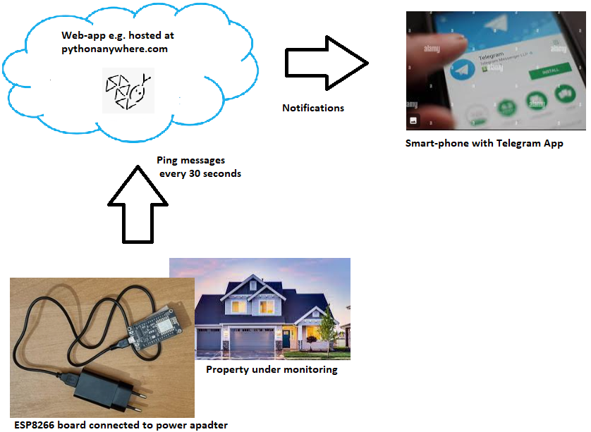

# EleBot

EleBot notifies you over Telegram when electricity in your place of interest disappears or appears.
Its concept is based on sending ping messages periodically when electricity in your property is available.
This allows Web App to know whether elecricity is on or off. Transitionings are to be notofied tp your Telegram App.

*Prerequisites*

- ESP8266-based HW: ESP8266 board, USB Power Adapter, Micro-USB cable.

- 2.4GHz WiFi network at the property under monitoring (backup power is not mandatory).

- pythonanywhere account (free account is enough).

- vscode with platformio extension.

*How To Steps*

- TBD

